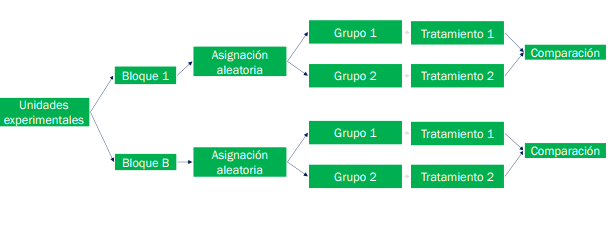
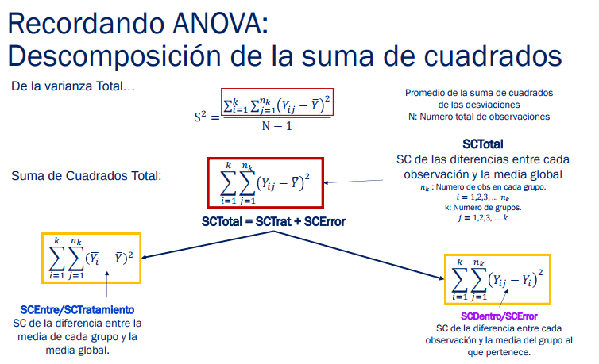
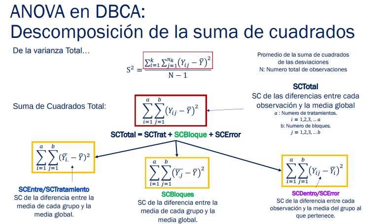
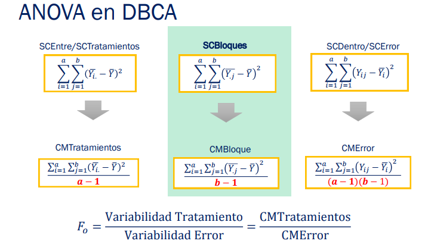

# Clase 11

## Diseño completamente randomizado o al azar (DCA)
- Es el más simple
- útil cuando las unidades experientales son homogéneas; cuando la variación entre ellas es pequeña que al agreuparlas en bloques, la ganancia e precisión es insignificante
- Los tratamientos se asigna aleatoriamente a las unidades experimentales sin imponer restricción

### Ventajas
- Flexible en cuanto al número de tratamiento y repeticiones
- El numero de repeticiones puede variar de un tratamiento a otro
- Análisis estadístico simple

### Desventajas
- Ineficiencia, debio a  que el error incluye toda la variación entre las unidades experimentales excepto a la debida a los tratamientos


### Ejemplo: Dietas

Con la finalidad de comparar los tiempos (en segundos) promedios de
coagulación de animales sometidos a 4 dietas diferentes: A, B, C y D, se
realizó un experimento con 24 animales de características similares. Las
dietas fueron asignados aleatoriamente entre los animales. Las muestras
fueron tomadas en orden aleatorios. Los datos obtenidos se muestran a
continuación.

Tratamientos:
``` R
A <- c(62,60,63,59)
B <- c(63,67,71,64,65,66)
C <- c(68,66,71,67,68,68)
D <- c(56,62,60,61,63,64,63,59)
```

Formar tablas de resultados
``` R
resultado <- c(A,B,C,D)


dietas <- c(rep("A",length(A)),
            rep("B",length(B)),
            rep("C",length(C)),
            rep("D",length(D)))

misdatos <- data.frame(dietas,resultado)
```

Generar boxplot
``` R
boxplot(resultado~dietas,misdatos, main="Tiempo de coagulación de la sangre segun dieta", ylab="Tiempo (segundos)")
```

Las medias de los grupos son iguales?
``` R
anova1 <- aov(resultado~dietas,misdatos)
summary(anova1)
```

Efectos de tratamientos en las dietas
``` R
mu.est <- mean(misdatos$resultado)
mu.est
#aplicar media por grupos
mean_treatment <-  aggregate(resultado~dietas,misdatos,mean)
mean_treatment
#diferencia media por gruposy media global
effect_treatment <-  aggregate(resultado~dietas,misdatos,function(x){mean(x)-mu.est})
mu.est
effect_treatment
```

Si la dieta A es la dieta por defecto, hallar el efecto de las dietas sobre A
``` R
round(coefficients(anova1),2)
```

Si ahora la dieta B es la dieta por defecto que se les da a los animales.
Hallar el efecto de las dietas con respecto a la dieta B
``` R
misdatos$dietas <- relevel(misdatos$dietas,ref="B")
misdatos$dietas
anova1 <- aov(resultado~dietas,misdatos)
summary(anova1)
round(coefficients(anova1),2)
```

## Diseño de bloques completos aleatorizados (DBCA)

Cada unidad experimental es asignada a bloques según sus características.
Luego, dentro de cada bloque, cada unidad se asigna aleatoriamente a un grupo para recibir un tratamiento.


- Se usa cuando conocemos una fuente de variación y es controlable.
- Formación de bloques sirve para eliminar de manera sistemática el efecto de una fuente de variación conocida y controlable.
- Mejora la precisión de las comparaciones al eliminar la variabilidad debido a los bloques.
- Usualmente son bloques:
  - Los equipos o máquinas utilizadas en el experimento
  - Las personas del estudio
  - El tiempo en el que se realiza los experimentos

#### Ejemplo: DBCA

Experimento para compara el tiempo de ejecución de un programa con dos
metodologías diferentes. Se corren los programas en 3 servidores de
diferentes características.
  - Variable de respuesta: **Tiempo de ejecución**
  - Factor de tratamiento: **Metodología**. Niveles: Met1, Met2
  - Factor bloques: **Servidores**. Niveles: Servidor1, Servidor2, Servidor3.

Experimento del rendimiento de combustible de cinco tipos de aditivos de
gasolina. En la prueba se utilizan 5 vehículos.
  - Variable de respuesta: **Rendimiento del combustible**
  - Factor de tratamiento: **Aditivos de la gasolina**. Niveles: 1,2,3,4,5
  - Factor bloques: **Vehículos**. Niveles: 1,2,3,4,5

### ¿El tratamiento influye sobre la respuesta?

- Estamos interesados en si alguno de los tratamientos influye sobre la respuesta
- Si alguno es significativamente diferente de cero.
- Se utilizara ANOVA. Con ciertas modificaciones ya que estamos usando un diseño de bloques (DBCA)

### ANOVA en DBCA

1.


2.


3.


#### Ejemplo: Bacterias

Se están comparando tres soluciones de lavado a fin de estudiar su
efectividad para retardar el crecimiento de las bacterias de la leche en 5
galones. El análisis se hace en un laboratorio y solo pueden realizarse tres
ensayos en un día. Puesto que los días pueden representar una fuente de
variación potencial, el experimentador decide usar un DBCA. Se hacen
observaciones en 4 días y los datos se muestran a continuación.

Datos
``` R
res <- c(13,16,5,22,24,4,18,17,1,39,44,22)
factor <- c(1,2,3,1,2,3,1,2,3,1,2,3)
bloque <- c(1,1,1,2,2,2,3,3,3,4,4,4)

midata <- data.frame(factor,bloque,res)
```
Boxplots
``` R
boxplot(res~factor,midata, main="Retardo en el crecimiento de bacterias",
        ylab="Tiempo (segundos)",
        xlab="Factor: Soluciones de lavado")
boxplot(res~bloque,midata, main="Retardo en el crecimiento de bacterias",
        ylab="Tiempo (segundos)",
        xlab="Bloques: Días")

interaction.plot(midata$factor,midata$bloque,midata$res,
                         xlab="Factor: Soluciones de lavado",
                         ylab="Tiempo (segundos)",
                         leg.legend="Bloque")
```

ANOVA

H0: t1=t2=t3=t4=0

``` R
anova1 <- aov(res~as.factor(factor)+as.factor(bloque),midata)
summary(anova1)
```

``` R
midata <- data.frame(factor=as.factor(factor),bloque=as.factor(bloque),res)
anova1 <- aov(res~factor+bloque,midata)
summary(anova1)

# global Effect and Treatment Effect
mu.est <- mean(midata$res)
mean_treatment <-  aggregate(res~factor,midata,mean)
effect_treatment <-  aggregate(res~factor,midata,function(x){mean(x)-mu.est})
effect_block <-  aggregate(res~bloque,midata,function(x){mean(x)-mu.est})
mu.est
effect_treatment
effect_block

#Effects with control treatment
round(coefficients(anova1),4)

```
